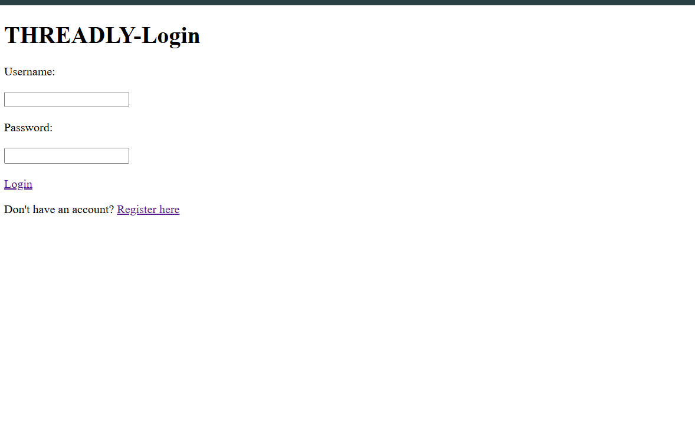
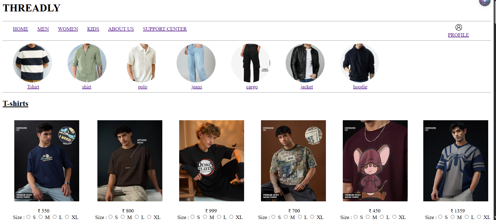
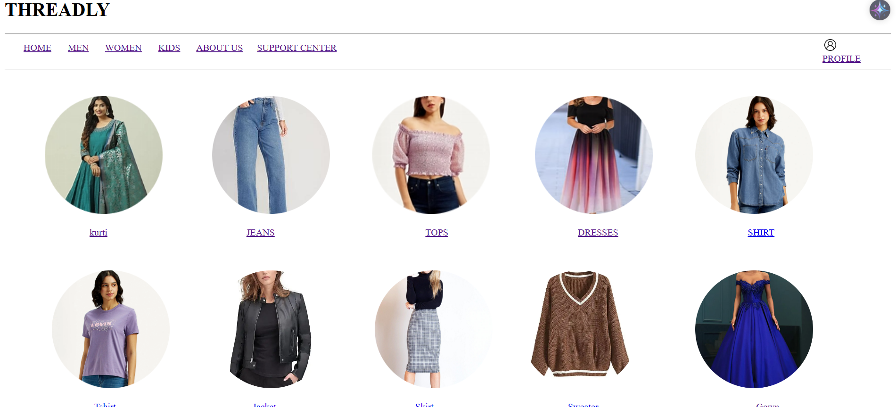
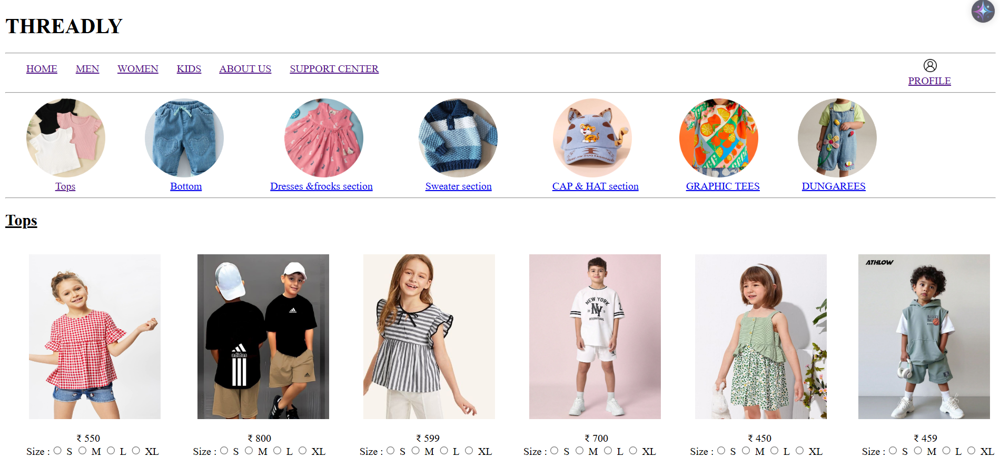
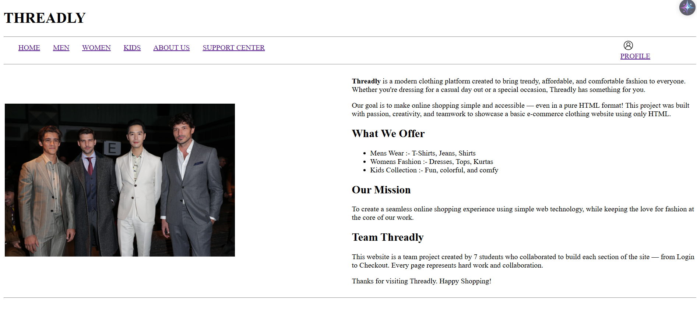
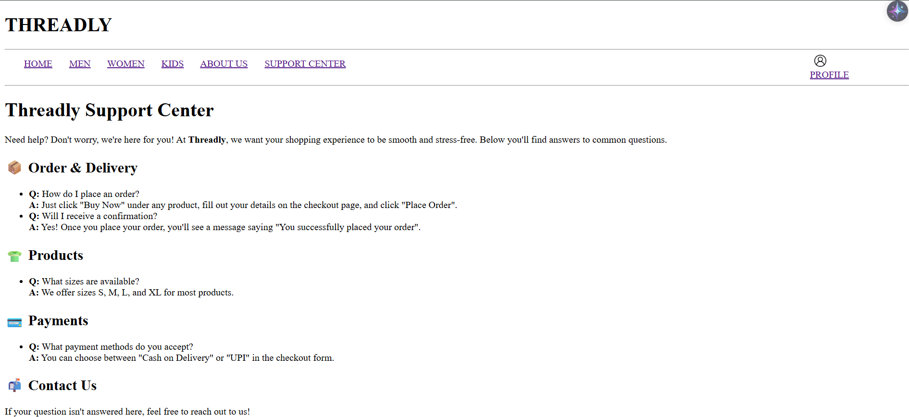
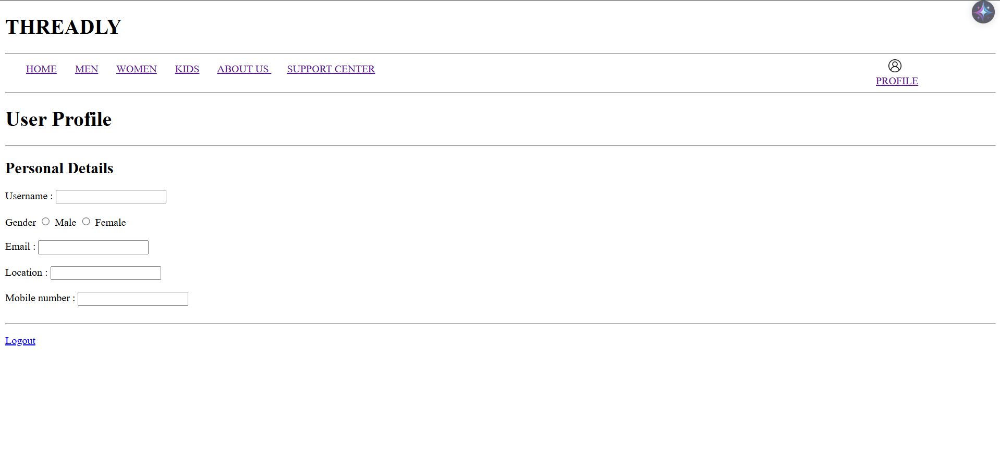

# THREADLY - Clothing Store Website
**Threadly** is a static e-commerce website created as a group project by 7 members.

---
## 🧑‍🤝‍🧑 Team Members

- 👤 Project Leader: [Hemang Khedikar]
- 👥 Total Members: 7

# Pages
There are total 10 pages :-
## Login page

## Home page

## Men's page

## Women's page

## Kid's page

## About us page

## Contact us page

## Profile page

## Delivery form page

## Order-confirmation

---
## 🔗 Navigation Flow

1. `loginpage.html` → Login into the site  
2. `index.html` → Homepage with product highlights  
3. Category pages: `Mens.html`, `women.html`, `Kids.html`  
4. `buy now.html` → Delivery form  
5. `order placed.html` → Order confirmation  
6. `profile.html` → Static user details form  
7. `about.html` and `contact.html` for brand & support info
   
---   
## 💡 Features

- All pages created using **pure HTML**
- Static navigation between multiple pages
- Product listings with prices and sizes
- Simulated "Buy Now" and order flow
---
## 🙌 Acknowledgements

This project was created as part of our group assignment. We focused on teamwork, learning structure, and planning a complete HTML website with meaningful navigation and user experience simulation.

---
## Contributors

Made with [contrib.rocks](https://contrib.rocks).